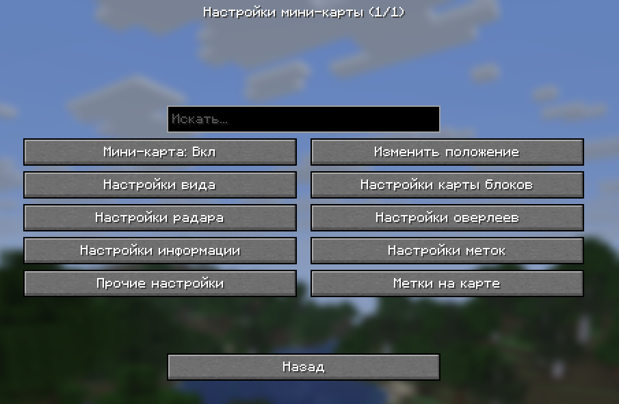
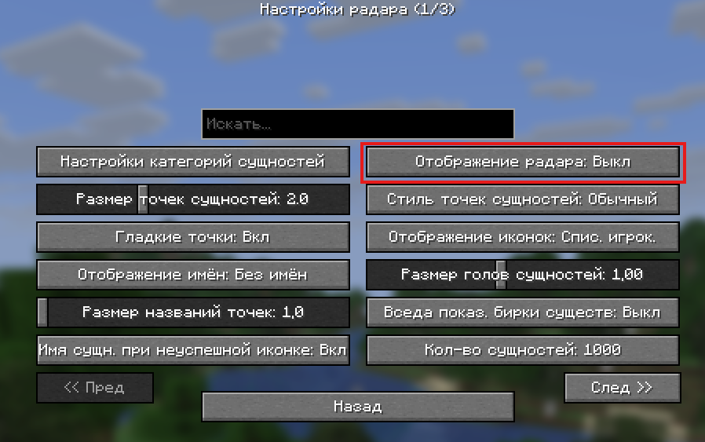
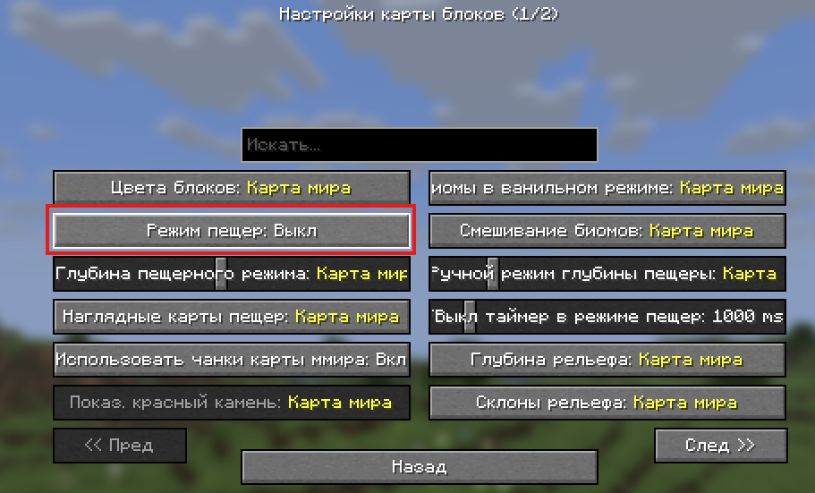
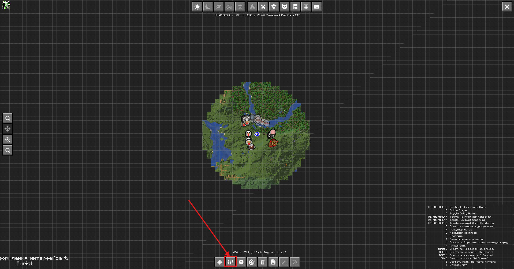
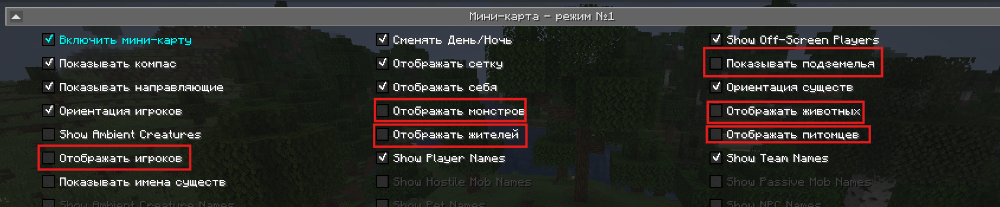
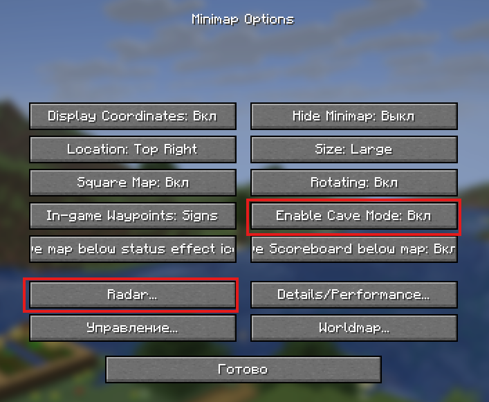
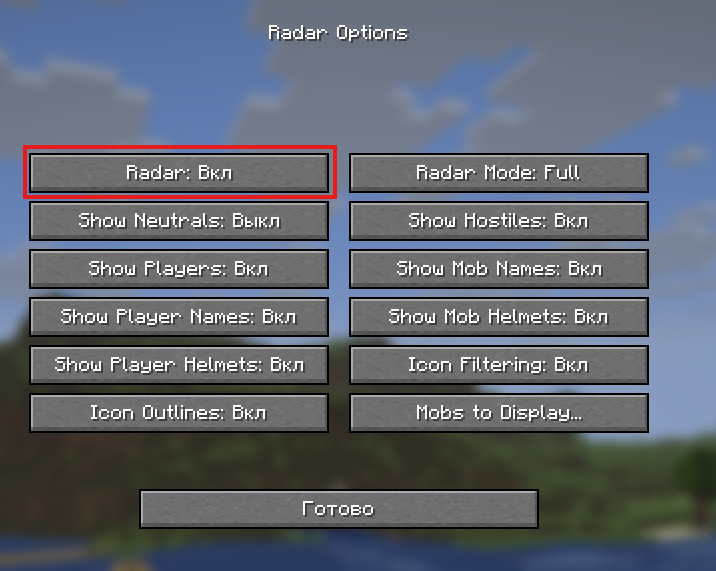

# 🗺️ | Как скрыть игроков, мобов и шахты на мини-картах 

Чтобы не нарушать правило **3.1** нашего проекта, ознакомьтесь с инструкцией по отключению отображения **игроков**, **пещер** и **мобов** на популярных мини-картах.

---

## 🧭 Xaero's Minimap / World Map
1. Откройте настройки мини-карты. *(По умолчанию клавиша **Y**)  
   { width="600" }
2. Перейдите в раздел **«Настройки радара»** и установите параметр **«Отображение радара»** в положение **«Выкл»**.  
   { width="600" }
3. Вернитесь в главное меню настроек.
4. Перейдите в **«Настройки карты блоков»** и установите **«Режим пещер»** на **«Выкл»**.  
   { width="600" }

---

## 🧭 JourneyMap
1. Откройте полноэкранную карту. *(По умолчанию клавиша **J**)*
2. Перейдите в **настройки**.  
   { width="600" }
3. Отключите следующие параметры **во всех режимах и на полноэкранной карте**:
   - Отображение игроков  
   - Отображение жителей  
   - Отображение питомцев  
   - Отображение животных  
   - Показывать подземелья  
   { width="600" }

---

## 🧭 VoxelMap
1. Откройте меню мини-карты. *(По умолчанию клавиша **M**)*
2. Перейдите в **настройки**.
3. Найдите параметр **«Enable Cave Mode»** и установите значение **«Выкл»**.
4. Перейдите в раздел **«Radar»**.  
   { width="600" }
5. Установите параметр **«Radar»** на **«Выкл»**.  
   { width="600" }

---
💡 **Совет:** После внесения изменений рекомендуется перезапустить клиент, чтобы настройки применились корректно.
